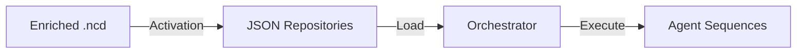

# NormCode Activation Compilation Specification

## 1. Process Overview

As defined in `shared---normcode_compilations.md`, **Activation** is the final phase of the NormCode compilation pipeline. It bridges the gap between the semantically enriched `.ncd` format and the runtime execution engine.



### 1.1 Inputs and Outputs

*   **Input**: **Enriched `.ncd`** (Post-Formalization output)
    *   Contains unique flow indices (`1.2.1`)
    *   Contains resolved sequence types (`imperative`, `grouping`)
    *   Contains explicit reference structure (`%>`, `%<`, `%:`, `%^`, `%@` modifiers)
    *   Contains paradigm configurations and resource paths

*   **Output**: **Executable Repositories**
    *   `concept_repo.json`: Static definitions of all data entities (types, shapes, ground values).
    *   `inference_repo.json`: Operational definitions, specifically populating the `working_interpretation` field required by the runtime.

### 1.2 The Translation Task

The core task of Activation is **syntax mapping**: transforming the dense annotations of the `.ncd` file into the structured dictionary format (`working_interpretation`) that each Agent Sequence's `IWI` (Input Working Interpretation) step expects.

### 1.3 Syntax Version

This document uses the **Unified Modifier Syntax** as defined in `shared---normcode_syntatical_concepts_reconstruction.md`:

| Modifier | Name | Meaning | Direction |
|----------|------|---------|-----------|
| `%>` | Source | Input / Read from | `>` points AT the source |
| `%<` | Target | Output / Write to | `<` points TO the target |
| `%:` | Axis | Context axis / Base | Structural dimension |
| `%^` | Carry | Carried state / Selection | Contextual state |
| `%@` | Index | Quantifier ID / Number | Iteration identifier |

---

## 2. Outputs: The Repository Structure

Before diving into the extraction logic, let's define the target JSON structures. These are the contract that Activation must satisfy for the Orchestrator.

### 2.1 Concept Repository (`concept_repo.json`)

Stores the static definitions of all data entities.

```json
[
  {
    "id": "c-ground-price-data",
    "concept_name": "{simulated data: price data}",
    "type": "{}",
    "description": "Ground concept: file path for simulated price data",
    "is_ground_concept": true,
    "reference_data": [
      "%{file_location}price(provision/data/price_data.json)"
    ],
    "reference_axis_names": ["_none_axis"]
  },
  {
    "id": "c-investment-decision",
    "concept_name": "{investment decision}",
    "type": "{}",
    "axis_name": "_none_axis",
    "description": "Final synthesized investment decision",
    "reference_axis_names": ["_none_axis"]
  }
]
```

### 2.2 Inference Repository (`inference_repo.json`)

Stores the operational definitions and the `working_interpretation`.

```json
[
  {
    "flow_info": { "flow_index": "1.6" },
    "inference_sequence": "judgement_in_composition",
    "concept_to_infer": "<signals surpass theoretical expectations>",
    "function_concept": ":%(composition):({1}<$({validated signal})%> exceeds...)",
    "value_concepts": [
      "{validated signal}",
      "{theoretical framework}"
    ],
    "working_interpretation": {
      "paradigm": "v_Prompt-h_Data-c_ThinkJSON-o_Normal",
      "value_order": {
        "{validated signal}": 1,
        "{theoretical framework}": 2
      },
      "assertion_condition": {
        "quantifiers": { "axis": "for-each", "concept": "{validated signal}" },
        "condition": true
      }
    }
  }
]
```

## 3. Strategy: Meet from Both Ends

Rather than defining `.ncd` grammar in isolation, we approach this problem from both directions:

1. **Bottom-up (Execution Requirements)**: What does each sequence's IWI step EXPECT to receive in `working_interpretation`?
2. **Top-down (Extraction Rules)**: How do we parse `.ncd` syntax to PRODUCE that structure?

This document starts with the bottom-up analysis, then analyzes real examples to discover patterns.

---

## Key Findings (Executive Summary)

After analyzing actual inference repos, we discovered that activation compilation is **more sophisticated than simple parsing**:

### Complexity Discovered

1. **value_order contains synthetic keys** not present in value_concepts
   - Example: `"input_files_as_dict"` appears in value_order but not in the value_concepts list
   - These are intermediate transformation results

2. **value_selectors is a data transformation layer**
   - Extracts nested data: `{"source_concept": "{input files}", "key": "{original prompt}"}`
   - Can unpack, index, and branch based on perceptual signs
   - Requires concept provenance tracking (knowing how concepts were created)

3. **Paradigm names are highly structured**
   - `.ncd` might have `{%(composition)}` but repo has `"h_PromptTemplateInputOther_SaveDir-c_GenerateThinkJson-Extract-Save-o_FileLocation"`
   - Suggests a registry or construction system (not yet located)

4. **Branch field for perceptual signs**
   - `{"path": "NULL", "content": "file_location"}` controls transmutation
   - Likely extracted from markers like `<$%={normal/location_string}>`

### Missing Pieces

- The `.ncd` source file for phase_1 examples (need to see input syntax)
- Paradigm registry/mapping system
- Concept provenance tracking mechanism
- Rules for when to create value_selectors
- Axis name inference algorithm

---

---

## Part 1: Working Interpretation Requirements (Bottom-Up)

Each inference sequence has an IWI (Input Working Interpretation) step that expects a specific structure. Here's what each sequence needs:

### 1.1. Common Structure (All Sequences)

**Every** `working_interpretation` must include:

```python
{
    "workspace": dict,          # Runtime state (loop iterations, carried concepts)
    "flow_info": {
        "flow_index": str       # e.g., "1.2.3"
    }
}
```

### 1.2. Assigning Sequence

**File**: `infra/_agent/_steps/assigning/_iwi.py`

**Reference**: See `infra/_agent/_steps/assigning/README.md` for full documentation.

The assigning sequence has **five different operations**, each with specific field requirements:

**Base Structure (all operations)**:
```python
{
    "syntax": {
        "marker": str,              # "=", ".", "+", "-", "%"
        "assign_source": str | list[str],  # Source concept(s)
        "assign_destination": str,  # Destination concept
    },
    "workspace": dict,
    "flow_info": {"flow_index": str}
}
```

**Operation-Specific Fields**:

| Marker | Operation | Additional Fields | Description |
|--------|-----------|-------------------|-------------|
| `"="` | Identity | `canonical_concept`, `alias_concept` | Merge two concept names into one |
| `"%"` | Abstraction | `face_value`, `axis_names` | Create reference from literal |
| `"."` | Specification | (none) | Select first valid from sources |
| `"+"` | Continuation | `by_axes` | Append source to destination |
| `"-"` | Derelation | `selector` | Extract by index/key/unpack |

**Complete Field Reference**:
```python
{
    "syntax": {
        # Common fields
        "marker": str,                    # "=", "%", ".", "+", "-"
        "assign_source": str | list[str], # Source concept(s)
        "assign_destination": str,        # Destination concept
        
        # Continuation ($+)
        "by_axes": list[str],             # Axes to append along
        
        # Abstraction ($%)
        "face_value": Any,                # Literal value (string, list, perceptual sign)
        "axis_names": list[str],          # Axes for structured data
        
        # Derelation ($-)
        "selector": {
            "index": int,                 # Select by index (0, -1, etc.)
            # OR
            "key": str,                   # Select by dictionary key
            # OR
            "unpack": bool                # Flatten/spread list
        },
        
        # Identity ($=)
        "canonical_concept": str,         # The existing concept name
        "alias_concept": str              # The new name (alias)
    },
    "workspace": dict,
    "flow_info": {"flow_index": str}
}
```

**Examples**:

**Identity ($=)**:
```ncd
{input question}
    <= $= %>({user query})
    <* {user query}
```
→ Produces:
```python
{
    "syntax": {
        "marker": "=",
        "canonical_concept": "{user query}",
        "alias_concept": "{input question}"
    }
}
```

**Abstraction ($%)**:
```ncd
{number pair}
    <= $% %>(["123", "456"]) %:([{number}])
```
→ Produces:
```python
{
    "syntax": {
        "marker": "%",
        "face_value": ["123", "456"],
        "axis_names": ["{number}"]
    }
}
```

**Specification ($.)** :
```ncd
{result}
    <= $. %>({remainder})
    <- {remainder}
```
→ Produces:
```python
{
    "syntax": {
        "marker": ".",
        "assign_source": "{remainder}",
        "assign_destination": "{result}"
    }
}
```

**Continuation ($+)**:
```ncd
{number pair}
    <= $+ %>({number pair}) %<({number pair to append}) %:({number pair})
    <- {number pair to append}
```
→ Produces:
```python
{
    "syntax": {
        "marker": "+",
        "assign_source": "{number pair to append}",
        "assign_destination": "{number pair}",
        "by_axes": ["{number pair}"]
    }
}
```

**Derelation ($-)**:
```ncd
{first_element}
    <= $- %>({collection}) %^(<$*0>)
```
→ Produces:
```python
{
    "syntax": {
        "marker": "-",
        "assign_source": "{collection}",
        "selector": {"index": 0}
    }
}
```

**Derelation by key**:
```ncd
{prompt_value}
    <= $- %>({input files}) %^(<$({original prompt})%>)
```
→ Produces:
```python
{
    "syntax": {
        "marker": "-",
        "assign_source": "{input files}",
        "selector": {"key": "{original prompt}"}
    }
}
```

**Derelation with unpack**:
```ncd
{all_items}
    <= $- %>({collection}) %^(<$*#>)
```
→ Produces:
```python
{
    "syntax": {
        "marker": "-",
        "assign_source": "{collection}",
        "selector": {"unpack": true}
    }
}
```

**Implementation Note**: Identity (`$=`) requires orchestrator-level blackboard access. The AR step sets `identity_pending = True`, and the orchestrator must call `blackboard.register_identity(alias, canonical)`.

---

### 1.3. Grouping Sequence

**File**: `infra/_agent/_steps/grouping/_iwi.py`

**Reference**: See `infra/_agent/_steps/grouping/README.md` for full documentation.

**Expected Structure**:
```python
{
    "syntax": {
        "marker": str,              # "in" or "across"
        # Legacy format (backward compatible)
        "by_axis_concepts": list,   # Concepts whose axes define what to collapse
        # New format (for or_across per-reference collapse)
        "by_axes": list,            # List[List[str]] - per-reference axes to collapse
        "create_axis": str,         # Name for the resulting axis dimension
        "protect_axes": list        # Axes to preserve (don't collapse)
    },
    "workspace": dict,
    "flow_info": {"flow_index": str}
}
```

**Two Grouping Modes**:

| Marker | NormCode Syntax | Result Structure | Use Case |
|--------|-----------------|------------------|----------|
| `"in"` | `&[{}]` or `&[{}] %+({axis})` | Dict-like annotated elements | Collect named inputs |
| `"across"` | `&[#]` or `&[#] %+({axis})` | Flat list or new axis | Flatten/concatenate/unify |

**Axis Mechanics**:
- `by_axis_concepts`: (Legacy) Context concepts whose axes will be **collapsed**
- `by_axes`: (New) List of per-reference axes to collapse, e.g., `[["ax1"], ["ax2"], ["ax3"]]`
- `create_axis`: (New) Name for the resulting axis dimension, e.g., `"signal"`
- `protect_axes`: Axes to **keep** even if they appear in by_axes

**Per-Reference Collapse (New)**:
When `by_axes` is a list of lists and `create_axis` is specified, each input reference is collapsed independently:
1. For each reference, collapse the specified axes in `by_axes[i]`
2. Concatenate all resulting elements
3. Wrap in a new `Reference` with `create_axis` as its dimension

**Example 1: Group Across**
```ncd
[all {unit place value} of numbers]
    <= &[#] %>({number pair}*1) %:({unit place value})
    <* {number pair}*1
```
→ Produces:
```python
{
    "syntax": {
        "marker": "across",
        "by_axis_concepts": ["{number pair}*1"],  # Context concept
        "protect_axes": []
    }
}
```

**Example 2: Group In (Legacy)**
```ncd
{input files}
    <= &[{}] %>[{original prompt}, {other input files}]
    <- {original prompt}
    <- {other input files}
```
→ Produces:
```python
{
    "syntax": {
        "marker": "in",
        "by_axis_concepts": [],  # No specific axis to collapse
        "protect_axes": []
    }
}
```

**Example 2b: Group In with Per-Reference Collapse**
```ncd
[all recommendations]
    <= &[{}] %>[{bullish recommendation}, {bearish recommendation}, {neutral recommendation}] %+(recommendation)
    <- {bullish recommendation}
    <- {bearish recommendation}
    <- {neutral recommendation}
```

The `%+(recommendation)` modifier explicitly names the resulting axis.

→ Produces:
```python
{
    "syntax": {
        "marker": "in",
        "by_axes": [
            ["bullish_recommendation"],   # Collapse this axis from first input
            ["bearish_recommendation"],   # Collapse this axis from second input
            ["neutral_recommendation"]    # Collapse this axis from third input
        ],
        "create_axis": "recommendation"   # Extracted from %+(recommendation)
    }
}
```

**Example 4: Group Across with Per-Reference Collapse**
```ncd
{validated signal}
    <= &[#] %>[{quantitative signal}, {narrative signal}, {theoretical framework}] %+(signal)
    <- {quantitative signal}
    <- {narrative signal}
    <- {theoretical framework}
```

The `%+(signal)` modifier explicitly names the resulting axis.

→ Produces:
```python
{
    "syntax": {
        "marker": "across",
        "by_axes": [
            ["quantitative_signal"],  # Collapse this axis from first input
            ["narrative_signal"],     # Collapse this axis from second input
            ["_none_axis"]            # Collapse this axis from third input
        ],
        "create_axis": "signal"       # Extracted from %+(signal)
    }
}
```

**Example 3: Group In with Protected Axes**
```ncd
{combined inputs}
    <= &[{}] %>[{prompt template}, {save path}] %:({input type}<$!{%(class)}>)
    <- {prompt template}
    <- {save path}
```
→ Produces:
```python
{
    "syntax": {
        "marker": "in",
        "by_axis_concepts": ["{input type}"],   # From %:(...)
        "protect_axes": ["{%(class)}"]          # From <$!{...}>
    }
}
```

**Value Concepts vs Context Concepts**:
- `<-` (value concepts) → Items to be grouped
- `<*` (context concepts) → Define `by_axes` for axis collapse

**Output Behavior**:
- `&[{}]` (marker="in"): Annotates each element with its source concept name → `{"{prompt}": value, "{path}": value}`
- `&[#]` (marker="across"): Flattens all elements into a single list → `[v1, v2, v3, ...]`

---

### 1.4. Imperative Sequence (Composition Mode)

**File**: `infra/_agent/_steps/imperative_in_composition/_iwi.py`

**Expected Structure**:
```python
{
    "paradigm": str,                      # REQUIRED! e.g., "python_script"
    "value_order": dict[str, int],        # Maps concept → position {"{digit sum}": 2}
    "value_selectors": dict,              # (optional) Filters for concept retrieval
    "values": dict[str, Any],             # Pre-populated ground values
    "create_axis_on_list_output": bool,   # Default: True
    "workspace": dict,
    "flow_info": {"flow_index": str}
}
```

**Key Questions for Extraction**:
- **Paradigm**: How do we determine which paradigm to use?
  - Could be explicit: `:%(python_script):(...)` 
  - Could be inferred from functional concept type
- **Value Order**: How do we extract `{1}`, `{2}`, `{3}` placeholders and map them to concept names?
- **Values**: How do we distinguish ground concepts (pre-set) from computed concepts?

**Example from `.ncd`**:
```ncd
{digit sum}
    <= ::(sum {1}<$([all {unit place value} of numbers])%> and {2}<$({carry-over number}*1)%> to get {3}?<$({sum})%>)
    <- [all {unit place value} of numbers]<:{1}>
    <- {carry-over number}*1<:{2}>
    <- {sum}?<:{3}>
```
→ Should produce:
```python
{
    "paradigm": "python_script",  # Inferred from ::(...) or explicit
    "value_order": {
        "[all {unit place value} of numbers]": 1,
        "{carry-over number}*1": 2,
        "{sum}?": 3
    },
    "value_selectors": {},  # Could extract from <$(...)%> patterns
    "values": {}  # Empty if no ground concepts
}
```

**REALITY CHECK - Real-World Complexity (Phase 1 Example)**:

Looking at actual inference repos reveals **much more complexity**:

```json
{
    "flow_info": {"flow_index": "1.2.2"},
    "inference_sequence": "imperative_in_composition",
    "concept_to_infer": "{1.1_instruction_block.md}",
    "function_concept": "::{%(composition)}({prompt}<$({instruction distillation prompt})%>: {1}<$({input files})%>)",
    "value_concepts": [
        "{instruction distillation prompt}",
        "{input files}",
        "{output file location of instruction distillation}"
    ],
    "working_interpretation": {
        "paradigm": "h_PromptTemplateInputOther_SaveDir-c_GenerateThinkJson-Extract-Save-o_FileLocation",
        "value_order": {
            "{instruction distillation prompt}": 0,
            "input_files_as_dict": 1,
            "{output file location of instruction distillation}": 2,
            "other_input_files": 3
        },
        "value_selectors": {
            "input_files_as_dict": {
                "source_concept": "{input files}",
                "index": 0,
                "key": "{original prompt}"
            },
            "other_input_files": {
                "source_concept": "{input files}",
                "index": 0,
                "key": "{other input files}",
                "unpack": true
            }
        }
    }
}
```

**Critical Observations**:

1. **value_order contains intermediate keys** that DON'T appear in `value_concepts`
   - `"input_files_as_dict"` and `"other_input_files"` are synthetic
   
2. **value_selectors acts as a transformation layer**:
   - `source_concept`: which concept to extract from
   - `index`: array/axis index
   - `key`: dictionary key to extract (for nested data)
   - `unpack`: whether to spread the result
   - `branch`: (seen in flow 1.2.3) with `path` and `content` fields

3. **Paradigm names are highly structured**:
   - `"h_PromptTemplateInputOther_SaveDir-c_GenerateThinkJson-Extract-Save-o_FileLocation"`
   - Appears to encode: horizontal inputs (h_), computation (c_), outputs (o_)

4. **create_axis_on_list_output**: Controls whether list outputs get an axis dimension

**This means**: The activation compiler must do sophisticated **data flow analysis** to determine:
- Which concepts need to be decomposed/transformed
- What intermediate keys are needed in value_order
- How to construct value_selectors for nested data access
- When to set create_axis_on_list_output to false

---

### 1.5. Judgement Sequence (Composition Mode)

**File**: `infra/_agent/_steps/judgement_in_composition/_iwi.py`

**Expected Structure**:
```python
{
    "paradigm": str,                      # REQUIRED!
    "value_order": dict[str, int],
    "value_selectors": dict,
    "values": dict[str, Any],
    "assertion_condition": dict,          # SPECIFIC TO JUDGEMENT
    "create_axis_on_list_output": bool,
    "workspace": dict,
    "flow_info": {"flow_index": str}
}
```

**Key Difference from Imperative**: The `assertion_condition` field.

**Example from `.ncd`**:
```ncd
<all number is 0>
    <= :%(True):<{1}<$({number})%> is 0>
    <- {number pair to append}<$={1}><:{1}>
```
→ Should produce:
```python
{
    "paradigm": "python_script",
    "value_order": {"{number pair to append}<$={1}>": 1},
    "assertion_condition": {
        "quantifier": "ALL",     # Extracted from :%(True)
        "truth_value": True      # or could be "0", "False", etc.
    }
}
```

**Key Questions**:
- How do we parse `:%(True):` vs `:%(ANY):` vs `:%(EXISTS):`?
- How does this map to quantifier logic?

---

### 1.6. Looping Sequence

**File**: `infra/_agent/_steps/looping/_iwi.py` (also `infra/_agent/_steps/quantifying/_iwi.py` for backwards compatibility)

**Reference**: See `infra/_agent/_steps/looping/README.md` for full documentation.

**Expected Structure**:
```python
{
    "syntax": {
        "marker": "every",                 # Currently only "every" is implemented
        "loop_index": int,                 # e.g., 1, 2 (for nested loops)
        "LoopBaseConcept": str,            # Original concept being looped over
        "CurrentLoopBaseConcept": str,     # The *N version (in-loop reference)
        "group_base": str,                 # Axis name for the loop
        "InLoopConcept": dict,             # Concepts carried between iterations
        "ConceptToInfer": list[str]        # Result concepts from each iteration
    },
    "workspace": dict,                     # CRITICAL: Persists across iterations!
    "flow_info": {"flow_index": str}
}
```

**Key Fields Explained**:

| Field | Description | Example |
|-------|-------------|---------|
| `loop_index` | Nesting level (1 = outermost, 2 = inner, etc.) | `1` |
| `LoopBaseConcept` | The collection to iterate over | `"{number pair}"` |
| `CurrentLoopBaseConcept` | Current element reference (auto-generated as `*N`) | `"{number pair}*1"` |
| `group_base` | Axis name extracted from `%:(...)` | `"number pair"` |
| `ConceptToInfer` | What gets computed each iteration | `["{new number pair}"]` |
| `InLoopConcept` | State carried between iterations: `{concept: carry_index}` | `{"{carry}*1": 1}` |

**Carry Index Meaning** (in `InLoopConcept`):
- `0`: Use initial value (from `context_concepts`)
- `1`: Use value from previous iteration
- `N`: Use value from N iterations back

**Example from `.ncd`** (new syntax):
```ncd
{new number pair}
    <= *. %>({number pair}) %<({new number pair}) %:({number pair}) %^({carry-over number}<$*-1>) %@(1)
    <- {number pair}
    <* {carry-over number}*1
```
→ Produces:
```python
{
    "syntax": {
        "marker": "every",
        "loop_index": 1,                            # From %@(1)
        "LoopBaseConcept": "{number pair}",         # From %>({number pair})
        "CurrentLoopBaseConcept": "{number pair}*1", # Auto-generated: base + "*" + loop_index
        "group_base": "number pair",                # From %:({number pair}) (strip braces)
        "InLoopConcept": {
            "{carry-over number}*1": 1              # From %^(...) annotation
        },
        "ConceptToInfer": ["{new number pair}"]     # From %<({new number pair})
    },
    "workspace": {},                                # Orchestrator must persist this!
    "flow_info": {"flow_index": "1"}
}
```

**Extraction Rules**:
- `<*` lines → context concepts (used for `InLoopConcept`)
- `<-` lines → value concepts (input data)
- `%@(N)` → `loop_index` (and generates `*N` suffix)
- `%:({...})` → `group_base` (extract axis name, strip braces)
- `%^({concept}<$*-N>)` → `InLoopConcept` entries with carry index N
- `%<({result})` → `ConceptToInfer`
- `%>({base})` → `LoopBaseConcept`

**Workspace Persistence**: The `workspace` dict is **critical** for loop operation. It stores:
- Which elements have been processed
- Results from each iteration
- Carried state between iterations

The orchestrator MUST pass the same workspace dict back on each iteration.

---

### 1.7. Timing Sequence

**File**: `infra/_agent/_steps/timing/_iwi.py`

**Reference**: See `infra/_agent/_steps/timing/README.md` for full documentation.

**Expected Structure**:
```python
{
    "syntax": {
        "marker": str,      # "after", "if", "if!"
        "condition": str    # Concept name to check (e.g., "<all number is 0>")
    },
    "blackboard": Blackboard,  # REQUIRED: Passed from orchestrator
    "workspace": dict,         # For filter injection
    "flow_info": {"flow_index": str}
}
```

**Markers and Behavior**:

| Marker | NormCode Syntax | Behavior |
|--------|-----------------|----------|
| `"after"` | `@. ({dep})` | Wait until condition is complete, then proceed |
| `"if"` | `@:' (<cond>)` | Wait until complete, then proceed if TRUE, skip if FALSE |
| `"if!"` | `@:! (<cond>)` | Wait until complete, then proceed if FALSE, skip if TRUE |

**Output Flags** (set by T step):
```python
states.timing_ready = bool    # Can parent inference proceed?
states.to_be_skipped = bool   # Should parent inference skip execution?
```

**Decision Matrix**:

| Marker | Condition Complete? | Condition Result | `timing_ready` | `to_be_skipped` |
|--------|---------------------|------------------|----------------|-----------------|
| `after` | No | N/A | `False` | `False` |
| `after` | Yes | Any | `True` | `False` |
| `if` | No | N/A | `False` | `False` |
| `if` | Yes | Success/True | `True` | `False` |
| `if` | Yes | condition_not_met | `True` | `True` |
| `if!` | No | N/A | `False` | `False` |
| `if!` | Yes | Success/True | `True` | `True` |
| `if!` | Yes | condition_not_met | `True` | `False` |

**Example from `.ncd`**:
```ncd
    <= @:! (<all number is 0>)
        <= @:' (<carry-over number is 0>)
```
→ Produces two inference entries:

**Entry 1** (flow_index: 1.1.3.1):
```python
{
    "syntax": {
        "marker": "if!",
        "condition": "<all number is 0>"
    },
    "blackboard": <Blackboard>,  # Orchestrator provides
    "workspace": {},
    "flow_info": {"flow_index": "1.1.3.1"}
}
```

**Entry 2** (flow_index: 1.1.3.1.1):
```python
{
    "syntax": {
        "marker": "if",
        "condition": "<carry-over number is 0>"
    },
    "blackboard": <Blackboard>,
    "workspace": {},
    "flow_info": {"flow_index": "1.1.3.1.1"}
}
```

**Filter Injection**: When `@:'`/`@:!` passes and the condition has a truth mask (from a for-each judgement), the timing step injects a filter into the workspace:
```python
workspace[f"__filter__{parent_flow_index}"] = [
    {
        'truth_mask': {'tensor': [...], 'axes': [...], 'filter_axis': '...'},
        'condition': '<condition>',
        'source_flow_index': '1.2.3.1'
    }
]
```

This filter can be applied by the parent inference's IR step to process only elements matching the condition.

---

### 1.8. Summary: Syntactical Sequences Working Interpretation

**Quick Reference Table**:

| Sequence | Markers | Key Fields | Step Pattern |
|----------|---------|------------|--------------|
| **Assigning** | `=`, `%`, `.`, `+`, `-` | `assign_source`, `assign_destination`, `by_axes`, `face_value`, `axis_names`, `selector`, `canonical_concept`, `alias_concept` | IWI→IR→AR→OR→OWI |
| **Grouping** | `in`, `across` | `by_axis_concepts`, `protect_axes` | IWI→IR→GR→OR→OWI |
| **Timing** | `after`, `if`, `if!` | `condition`, + `blackboard` from orchestrator | IWI→T→OWI |
| **Looping** | `every` | `loop_index`, `LoopBaseConcept`, `CurrentLoopBaseConcept`, `group_base`, `InLoopConcept`, `ConceptToInfer` | IWI→IR→GR→LR→OR→OWI |

**Common Fields (all sequences)**:
```python
{
    "syntax": {...},           # Sequence-specific
    "workspace": dict,         # Runtime state (critical for looping)
    "flow_info": {
        "flow_index": str      # e.g., "1.2.3"
    }
}
```

**Key Architectural Notes**:

1. **Syntactical vs Semantic**: Syntactical sequences (above) are **deterministic and free** (no LLM calls). They manipulate data structure.

2. **Workspace Persistence**: 
   - **Looping**: MUST persist workspace across iterations
   - **Timing**: Uses workspace for filter injection
   - **Others**: Workspace is available but typically unused

3. **Blackboard Dependency**:
   - **Timing**: REQUIRES blackboard for concept status queries
   - **Assigning (identity)**: Needs orchestrator to call `blackboard.register_identity()`
   - **Others**: No blackboard dependency

4. **Value vs Context Concepts**:
   - `<-` lines → `value_concepts` (input data)
   - `<*` lines → `context_concepts` (loop state, axis info)

**Detailed README References**:
- Assigning: `infra/_agent/_steps/assigning/README.md`
- Grouping: `infra/_agent/_steps/grouping/README.md`
- Timing: `infra/_agent/_steps/timing/README.md`
- Looping: `infra/_agent/_steps/looping/README.md`

---

## Part 2: Extraction Strategy (Top-Down)

Now that we know what each sequence NEEDS, we can define how to EXTRACT it from `.ncd` syntax.

### 2.1. General Parsing Pipeline

For each inference in the `.ncd` file:

```
1. Parse the functional concept (`<=` line)
   ↓
2. Determine the sequence type (imperative, grouping, timing, etc.)
   ↓
3. Parse all value concepts (`<-` lines) and context concepts (`<*` lines)
   ↓
4. Extract modifiers (%>, %<, %:, %^, %@)
   ↓
5. Build the working_interpretation dict according to sequence requirements
   ↓
6. Generate concept_repo and inference_repo entries
```

### 2.2. Key Extraction Rules

#### 2.2.1. Sequence Type Determination

**Rule**: Map functional concept syntax to sequence type based on the operator prefix.

**Syntactical Sequences** (deterministic, no LLM):

| Functional Concept Pattern | Sequence Type | Marker Extraction |
|----------------------------|---------------|-------------------|
| `*.` | `looping` | `"every"` |
| `&[{}]` | `grouping` | `"in"` |
| `&[#]` | `grouping` | `"across"` |
| `$=` | `assigning` | `"="` |
| `$.` | `assigning` | `"."` |
| `$+` | `assigning` | `"+"` |
| `$-` | `assigning` | `"-"` |
| `$%` | `assigning` | `"%"` |
| `@:'` | `timing` | `"if"` |
| `@:!` | `timing` | `"if!"` |
| `@.` | `timing` | `"after"` |

**Semantic Sequences** (LLM-driven):

| Functional Concept Pattern | Sequence Type | Notes |
|----------------------------|---------------|-------|
| `::({...})` or `({...})` | `imperative_in_composition` | Commands/actions |
| `::<{...}>` or `<{...}>` | `judgement_in_composition` | Boolean evaluations |
| `:%(paradigm):({...})` | `imperative_in_composition` | Explicit paradigm |
| `:%(paradigm):<{...}>` | `judgement_in_composition` | Explicit paradigm |

**Priority**: Check for syntactical operators FIRST (more specific), then fall back to semantic patterns.

#### 2.2.2. Syntactical Sequence Extraction Rules

Each syntactical sequence has specific extraction patterns based on the unified modifier system:

**Assigning Extraction**:

| `.ncd` Pattern | Extracted Field | Example |
|----------------|-----------------|---------|
| `$=`, `$.`, `$+`, `$-`, `$%` | `marker` | `"+"`  |
| `%>({concept})` | `assign_source` | `"{src}"` |
| `%<({concept})` | `assign_destination` | `"{dest}"` |
| `%:({axis})` or `%:([{ax1}, {ax2}])` | `by_axes` | `["{axis}"]` |
| Literal in `$% %>(...)` | `face_value` | `["123", "456"]` |
| `%:([{ax1}, {ax2}])` after `$%` | `axis_names` | `["{ax1}", "{ax2}"]` |
| `%^(<$*N>)` | `selector.index` | `N` |
| `%^(<$({key})%>)` | `selector.key` | `"key"` |
| `%^(<$*#>)` | `selector.unpack` | `true` |

**Grouping Extraction**:

| `.ncd` Pattern | Extracted Field | Example |
|----------------|-----------------|---------|
| `&[{}]` | `marker` | `"in"` |
| `&[#]` | `marker` | `"across"` |
| `%>({source})` or `%>[{s1}, {s2}]` | (sources from value concepts) | Items to group |
| `%:({axis})` | `by_axis_concepts` | `["{axis}"]` |
| `<$!{axis}>` inside `%:(...)` | `protect_axes` | `["{axis}"]` |
| `<*` lines | `by_axis_concepts` | Context concepts |

**Timing Extraction**:

| `.ncd` Pattern | Extracted Field | Example |
|----------------|-----------------|---------|
| `@:'` | `marker` | `"if"` |
| `@:!` | `marker` | `"if!"` |
| `@.` | `marker` | `"after"` |
| `(<condition>)` or `({concept})` | `condition` | `"<all number is 0>"` |

**Looping Extraction**:

| `.ncd` Pattern | Extracted Field | Example |
|----------------|-----------------|---------|
| `*.` | `marker` | `"every"` |
| `%>({base})` | `LoopBaseConcept` | `"{number pair}"` |
| `%<({result})` | `ConceptToInfer` | `["{new number pair}"]` |
| Auto-generated: `{base}*N` | `CurrentLoopBaseConcept` | `"{number pair}*1"` |
| `%@(N)` | `loop_index` | `1` |
| `%:({axis})` (strip braces) | `group_base` | `"number pair"` |
| `%^({concept}<$*-N>)` | `InLoopConcept` | `{"{carry}*1": N}` |

#### 2.2.3. Value Order Extraction (Semantic Sequences)

**Rule**: For imperative/judgement sequences, build `value_order` from placeholders.

**Strategy**:
1. Parse the functional concept for placeholders: `{1}`, `{2}`, `{3}`, etc.
2. Parse each `<-` value concept for bindings: `<:{1}>`, `<:{2}>`, etc.
3. Create mapping: `{concept_name: position_number}`

**Example**:
```ncd
<= ::(sum {1}<...> and {2}<...> to get {3}?<...>)
<- [all {unit place value} of numbers]<:{1}>
<- {carry-over number}*1<:{2}>
<- {sum}?<:{3}>
```
→ Extract:
```python
value_order = {
    "[all {unit place value} of numbers]": 1,
    "{carry-over number}*1": 2,
    "{sum}?": 3
}
```

#### 2.2.4. Axis Name Inference

**Challenge**: References need `axis_names` (e.g., `["number pair", "number"]`), but `.ncd` syntax doesn't always explicitly provide them.

**Strategies**:
1. **Explicit Axis Markers**: `%:({number pair})` → extract `"number pair"`
2. **Type-Based Defaults**:
   - `{}` (object) → No axes (scalar)
   - `[]` (relation) → Extract from concept name (e.g., `[all {unit place value} of numbers]` → `["unit place value"]`)
3. **Loop Context**: In `*.`, the loop creates a new axis (extract from `group_base`)
4. **Grouping Operations**: `&[#]` often creates/modifies axes

**This needs to be rigorously defined!**

#### 2.2.5. Ground Concept Identification

**Rule**: How do we know if a concept should be pre-populated in `concept_repo`?

**Candidates**:
- Concepts with `%{norm}(value)` annotations (perceptual signs)
- Concepts with `{%(literal)}` syntax (direct references)
- Concepts marked with `:>:` (input marker)
- Concepts defined with `$%` (abstraction) - these ARE ground concepts
- Concepts that have no parent inference (they're "given")

**Example**:
```ncd
{initial_value}
    <= $% %>(%{literal}zero(0))
```
→ This is a ground concept with `reference_data = ["%{literal}zero(0)"]`

---

## Part 3: Reverse-Engineering Real Examples

Let's analyze the phase_1 example to understand the patterns:

### 3.1. Example 1: Inference 1.2.2 (Instruction Distillation)

**Functional Concept**:
```
::{%(composition)}({prompt}<$({instruction distillation prompt})%>: {1}<$({input files})%>)
```

**Observations**:
1. **Paradigm extraction**: `{%(composition)}` → paradigm field gets `"h_Prompt..."`
   - But the actual value is much longer! How is this determined?
   - Hypothesis: The paradigm name might be stored elsewhere or constructed from multiple markers

2. **Value placeholders**: 
   - `{prompt}<$(...)%>` - marks a "prompt" role
   - `{1}<$(...)%>` - marks position 1, typed as "input files"

3. **Value concepts list**: `["{instruction distillation prompt}", "{input files}", "{output file location of instruction distillation}"]`
   - But value_order has FOUR entries!
   - The `{input files}` concept gets split into TWO intermediate keys

### 3.2. Example 2: Inference 1.2.2.4 (Grouping)

```json
{
    "flow_info": {"flow_index": "1.2.2.4"},
    "inference_sequence": "grouping",
    "concept_to_infer": "{input files}",
    "function_concept": "&[{}]",
    "value_concepts": ["{original prompt}", "{other input files}"],
    "working_interpretation": {
        "syntax": {"marker": "in"}
    }
}
```

**This is simpler** - just needs the marker. But notice:
- This groups `{original prompt}` and `{other input files}` into `{input files}`
- This is why inference 1.2.2 can later split `{input files}` using selectors!

**Pattern**: Grouping creates structured data that later imperatives can decompose.

### 3.3. Example 3: Inferences with Branch Selectors (1.2.3, 1.2.4)

```json
"value_selectors": {
    "input_files_as_dict": {
        "source_concept": "{input files}",
        "index": 0,
        "key": "{original prompt}",
        "branch": {
            "path": "NULL",
            "content": "file_location"
        }
    }
}
```

**New pattern**: The `branch` field!
- `"path": "NULL"` - means no path transformation?
- `"content": "file_location"` - extract the file location string?

**Hypothesis**: This is for **perceptual signs** - it tells the system to "transmute" the reference.

### 3.4. Pattern: create_axis_on_list_output

**Inference 1.2.2**: No `create_axis_on_list_output` field (defaults to true)
- Produces: `{1.1_instruction_block.md}` (single file)

**Inference 1.2.3**: `"create_axis_on_list_output": false`
- Produces: `[{1.2_initial_context_registerd.json}<*1>/{file_mapping.json}<*2>]` (relation)
- The `false` means: don't add a new axis, use the existing structure

**Pattern**: When output concept is `[]` (relation), you might want to control axis creation.

### 3.5. Questions This Raises

1. **How are intermediate value_order keys determined?**
   - `"input_files_as_dict"` - where does this name come from?
   - Is it hardcoded in the paradigm? Or derived from the selector structure?

2. **How is the paradigm name constructed?**
   - `"h_PromptTemplateInputOther_SaveDir-c_GenerateThinkJson-Extract-Save-o_FileLocation"`
   - This seems too specific to be in the .ncd file
   - Is there a separate paradigm registry/mapping?

3. **What triggers the creation of value_selectors?**
   - When `{input files}` is used, how do we know to split it?
   - Answer: Because it was created by `&[{}]` grouping! Need to track concept provenance

4. **What does the branch field control exactly?**
   - Seems related to perceptual sign handling
   - Need to understand the transmutation process

## Part 4: Open Questions and Gaps

### 4.1. Critical Gaps (Updated After Real Example Analysis)

1. **Axis Name Inference**: No systematic rule for determining `reference_axis_names`
   - When does a relation `[]` get multiple axes?
   - How do nested loops affect axes?
   - *Status: Still completely unclear*

2. **Paradigm Selection**: MUCH more complex than initially thought
   - The `.ncd` might have `{%(composition)}` but actual paradigm is `"h_Prompt...SaveDir..."`
   - Where is the full paradigm name stored or constructed?
   - Is there a mapping file? Or is it inferred from the functional concept structure?
   - *Status: Major gap - need to find paradigm registry or construction logic*

3. **Value Selectors**: Now understood to be a **data transformation layer**
   - Extracts sub-parts of structured concepts (dictionaries, nested data)
   - But HOW are these selectors generated from `.ncd` syntax?
   - Key questions:
     - How do we know `{input files}` needs to be split?
     - Where do intermediate keys like `"input_files_as_dict"` come from?
     - What triggers `branch` field creation?
   - *Status: Partially understood (purpose), but extraction rules unknown*

4. **value_order with synthetic keys**:
   - value_order contains keys NOT in value_concepts
   - These seem to be intermediate transformation results
   - How are these generated? Is it paradigm-specific?
   - *Status: Major gap - this breaks simple extraction*

5. **Workspace Initialization**: What goes in the initial `workspace` dict?
   - *Status: Still unclear*

6. **Identity vs. Instance Markers**: 
   - `<$={1}>` (identity) vs `<$(concept)%>` (instance) — how do they interact?
   - Are these just for disambiguation, or do they affect execution?
   - *Status: Still unclear*

7. **Branch field in value_selectors**:
   - Contains `{"path": "NULL", "content": "file_location"}`
   - Appears related to perceptual sign transmutation
   - How is this extracted from `.ncd`? From markers like `<$%={normal/location_string}>`?
   - *Status: New discovery - need to understand perceptual sign handling*

8. **create_axis_on_list_output logic**:
   - When should this be `true` vs `false`?
   - Seems related to whether output is `[]` (relation)
   - But what's the exact rule?
   - *Status: Partially understood*

### 4.2. Strategy for Resolution (Updated)

The real examples show this is **more complex than a simple parser**. We need a multi-layered approach:

**Phase 1: Find the Missing Pieces**

1. ✅ **Document IWI requirements** (COMPLETED)
2. ✅ **Examine real inference repos** (COMPLETED - phase_1_inference_full.json)
3. ⏳ **Find the corresponding `.ncd` source** 
   - We need to see what `.ncd` syntax produced the phase_1 repos
   - This will reveal the extraction patterns
4. ⏳ **Locate paradigm registry/mapping**
   - How does `{%(composition)}` → `"h_PromptTemplate..."`?
   - Is there a file that maps paradigm short names to full names?
5. ⏳ **Examine concept provenance tracking**
   - How does the system know `{input files}` was created by `&[{}]` grouping?
   - Is there metadata tracking concept creation?

**Phase 2: Understand Data Flow**

6. ⏳ **Trace value_selectors generation**
   - Find code that creates value_selectors during activation compilation
   - Understand the rules for when to split concepts
7. ⏳ **Understand branch field**
   - Find perceptual sign transmutation logic
   - Map `.ncd` markers to branch configurations

**Phase 3: Codify and Implement**

8. ⏳ **Write extraction rules** based on discovered patterns
9. ⏳ **Implement/verify compiler** logic
10. ⏳ **Test round-trip**: .ncd → repos → execution

**Immediate Next Steps**:

We should look for:
- The `.ncd` file that generated phase_1_inference_full.json
- The paradigm registry or mapping system
- The activation compilation code (if it exists)
- Addition algorithm repos + corresponding .ncd

---

## Part 5: Compilation Target Structure

For reference, here's what the activation compiler must OUTPUT:

### 5.1. Concept Repository Entry

```json
{
  "concept_name": "{digit sum}",
  "type": "{}",
  "is_ground_concept": false,
  "is_final_concept": false,
  "reference_data": null,
  "reference_axis_names": null
}
```

### 5.2. Inference Repository Entry

```json
{
  "flow_index": "1.1.2",
  "inference_sequence": "imperative_in_composition",
  "concept_to_infer": "{digit sum}",
  "function_concept": "::(sum {1}<...> and {2}<...> to get {3}?<...>)",
  "value_concepts": [
    "[all {unit place value} of numbers]",
    "{carry-over number}*1",
    "{sum}?"
  ],
  "context_concepts": [],
  "working_interpretation": {
    "paradigm": "python_script",
    "value_order": {"[all {unit place value} of numbers]": 1, ...},
    "workspace": {},
    "flow_info": {"flow_index": "1.1.2"}
  }
}
```

---

## Part 6: Syntax Quick Reference

### 6.1. Unified Modifier System

All syntactic operators use the same modifier vocabulary:

| Modifier | Name | Meaning | Usage |
|----------|------|---------|-------|
| `%>` | Source | Input / Read from | `%>({source_concept})` or `%>[{s1}, {s2}]` |
| `%<` | Target | Output / Write to | `%<({target_concept})` |
| `%:` | Axis | Context axis | `%:({axis})` or `%:([{ax1}, {ax2}])` |
| `%^` | Carry | Carried state / Selection | `%^({carried}<$*-1>)` or `%^(<$*0>)` |
| `%@` | Index | Quantifier ID | `%@(1)` for loop nesting level |

### 6.2. Operator Reference

| Operator | Symbol | Pattern | Produces |
|----------|--------|---------|----------|
| **Identity** | `$=` | `$= %>({source})` | Alias concepts |
| **Abstraction** | `$%` | `$% %>({literal}) %:([{axes}])` | Ground concept |
| **Specification** | `$.` | `$. %>({child})` | Select first valid |
| **Continuation** | `$+` | `$+ %>({dest}) %<({src}) %:({axis})` | Append |
| **Derelation** | `$-` | `$- %>({src}) %^(<selector>)` | Extract element |
| **Group In** | `&[{}]` | `&[{}] %>[{items}] %:({axis})` | Dict structure |
| **Group Across** | `&[#]` | `&[#] %>({src}) %:({axis})` | Flat list |
| **Conditional** | `@:'` | `@:' (<condition>)` | If true |
| **Negated** | `@:!` | `@:! (<condition>)` | If false |
| **Sequencing** | `@.` | `@. ({dependency})` | After complete |
| **Iterate** | `*.` | `*. %>({base}) %<({result}) %:({axis}) %^({carry}) %@(N)` | Loop |

### 6.3. Selection Conditions (for `$-`)

| Selector | Pattern | Meaning |
|----------|---------|---------|
| Index | `%^(<$*N>)` | Select at index N (0, -1, etc.) |
| Key | `%^(<$({key})%>)` | Select by dictionary key |
| Unpack | `%^(<$*#>)` | Flatten/spread all items |

### 6.4. Iteration Version Semantics

| Notation | Meaning |
|----------|---------|
| `*0` | Initial value (before first iteration) |
| `*1`, `*2`, ... | Current value in loop 1, loop 2 (for nested loops) |
| `*-1` | Previous iteration's value |
| `*-N` | N iterations back |

---

## Part 7: Next Actions

To complete this specification, we need to:

1. ✅ **Document IWI requirements** (DONE above)
2. ⏳ **Analyze working examples** (addition algorithm, phase_1 repos)
3. ⏳ **Define extraction rules** for each field
4. ⏳ **Specify axis name inference** algorithm
5. ⏳ **Write formal grammar** (if needed after above steps)
6. ⏳ **Implement/verify compiler** logic

**Current Status**: We've completed the bottom-up analysis. Next, we should examine real `.ncd` + `repo.json` pairs to reverse-engineer the extraction patterns.
